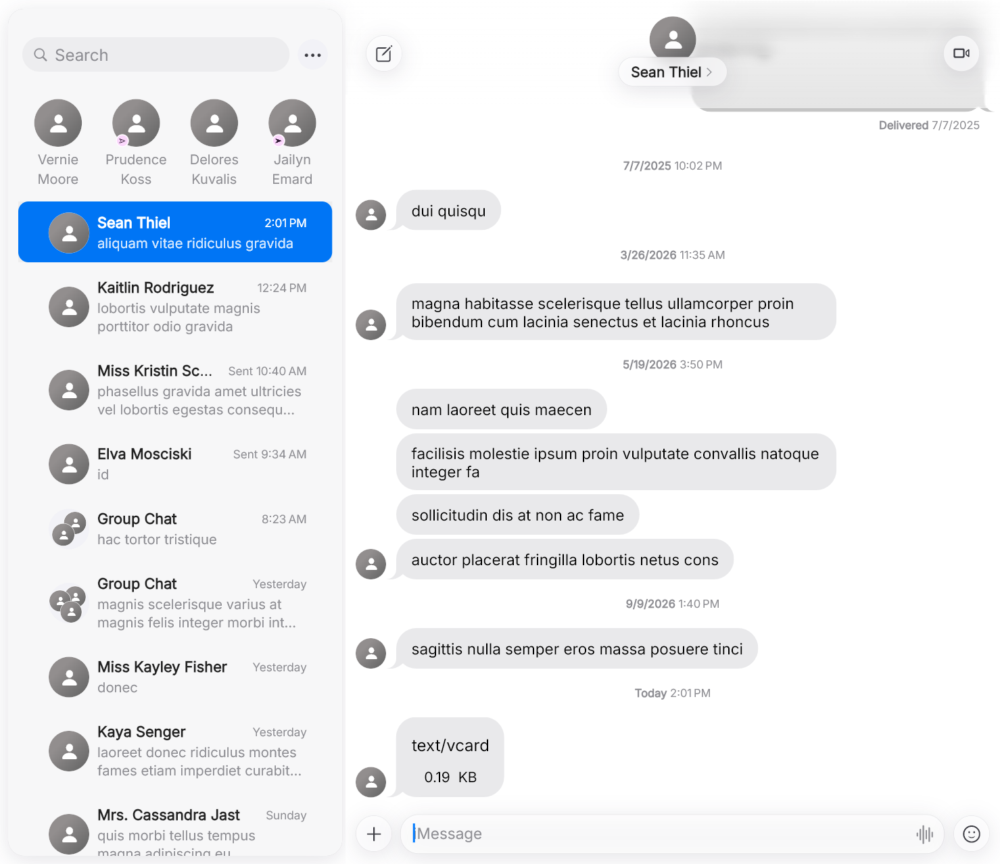

# OpenBubbles (desktop fork)

A personal fork of [OpenBubbles](https://github.com/OpenBubbles/openbubbles-app), focused on the Windows desktop app.

Screenshot taken in Redacted Mode, so names and messages are placeholders.

**Download**

Get the latest Windows installer (`OpenBubbles-Desktop-Setup-x.y.z.exe`) from [Releases](https://github.com/Midielhg/OpenBubbles/releases). It installs for your user account, with no admin rights needed. The installer isn't code-signed, so Windows SmartScreen may warn you: choose **More info → Run anyway**.

To register with iMessage you need your own Mac running [mac-registration-provider](https://github.com/beeper/mac-registration-provider) in relay mode (see below). Nothing in this app uses anyone else's account or Mac.

**What's different from upstream**

- macOS Tahoe style desktop UI: a floating sidebar card, Liquid Glass toolbar buttons, an inline search field, and the macOS Light/Dark themes.
- Registration through a relay with your own Mac, using Beeper's [mac-registration-provider](https://github.com/beeper/mac-registration-provider). The public source only ships the validation-data stub, so a Mac snapshot can't register.
- Fixes for iCloud Keychain / Messages in iCloud on relay setups (relay device identity), for iCloud contacts (CardDAV), and for desktop contact matching.
- Read-only Outlook / Exchange contacts through Microsoft Graph. Bring your own Entra app registration: a public client with delegated `Contacts.Read` and `offline_access`.
- Windows build fixes for ARM64 hosts, long paths, and vendored OpenSSL.

The `rustpush` submodule points at [Midielhg/rustpush](https://github.com/Midielhg/rustpush) (branch `openbubbles-dev`).

**Building on Windows**

1. Clone with submodules: `git clone --recursive https://github.com/Midielhg/OpenBubbles.git`
2. Install Flutter 3.24.0, Rust (add the target: `rustup target add x86_64-pc-windows-msvc`), and VS 2022 Build Tools with the C++ workload plus the ATL component (and the ARM64 tools on an ARM PC). Also install protoc, Strawberry Perl, NASM and NuGet (for example with winget).
3. Turn on Windows Developer Mode, and set `HKLM\SYSTEM\CurrentControlSet\Control\FileSystem\LongPathsEnabled` to `1`.
4. Create placeholder Fairplay certs, as in `.github/workflows/build.yml`.
5. Run `bash scripts/build-windows-local.sh`. The build lands in `build/windows/x64/runner/Release/`.

To regenerate the Rust bindings, use `flutter_rust_bridge_codegen` 2.3.0 with `CARGO_BUILD_TARGET=x86_64-pc-windows-msvc`, then run `python scripts/dedupe_frb_impls.py`.

Not affiliated with Apple. iMessage and FaceTime are trademarks of Apple Inc.

---

# OpenBubbles

OpenBubbles is an open-source and cross-platform ecosystem of apps aimed to bring Apple platform services to Android and Windows! With OpenBubbles, you'll be able to send messages, media, and much more to your friends and family.

**Please note that OpenBubbles requires access to a Mac and an Apple ID to function!

Key Features:

- Send/receive emoji reactions 
- Send formatted messages (bold, italic, etc)
- Edit messages
- Unsend messages 
- Call your friends on FaceTime
- Answer calls from your friends on FaceTime
- See friends' locations on FindMy
- Join and Sync iCloud Shared Albums
- See typing indicators
- Receive stickers
- Create and manage group chats
- Add an icon to personalize your group chat 
- Send images and videos
- Forward SMS and MMS to/from connected Macs or other devices with OpenBubbles 

If you need help setting up the app, have any issues or feature requests, or just want to come hang out, feel free to join our Discord, linked below! We hope you enjoy using the app!

## Useful links

* Our Website: [here](https://openbubbles.app)
* Discord: [here](https://discord.gg/98fWS4AQqN)!
    - We highly encourage users to join to get in direct communication with the developers and community
* GitHub: [here](https://github.com/OpenBubbles)
    - Please submit any issues with the app here so we can properly track them! Remember to search before opening a ticket :)

## Getting Started

[Quickstart](https://openbubbles.app/quickstart.html)
